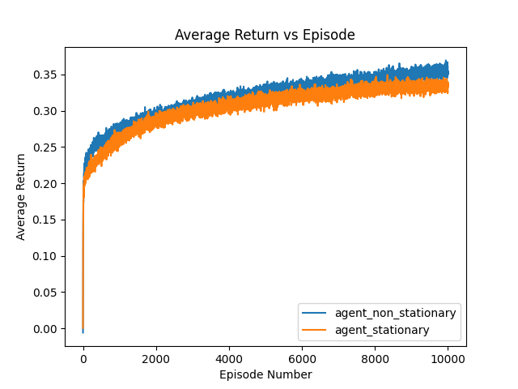
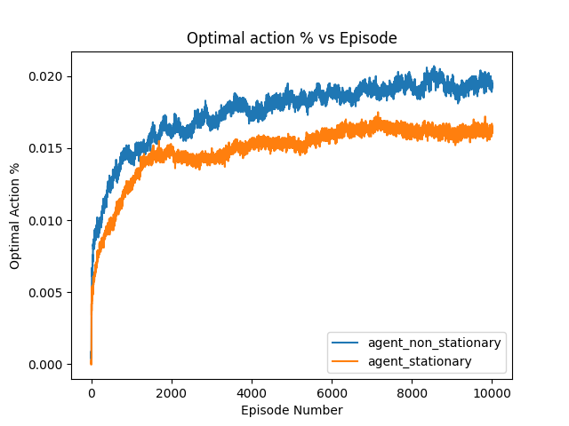
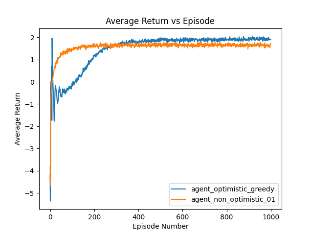
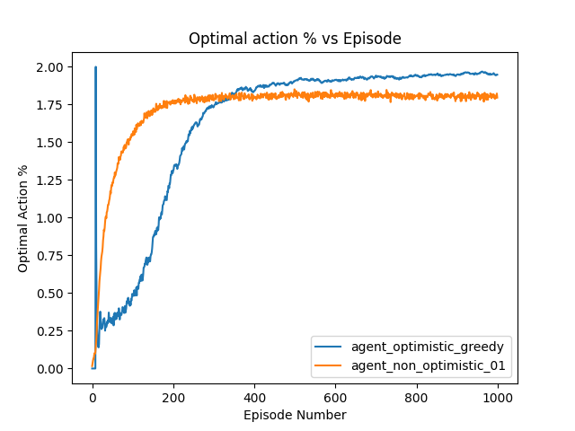

Solutions to Exercises

*Exercise 2.1* In "-greedy action selection, for the case of two actions and " = 0.5, what is
the probability that the greedy action is selected?

0.75, ie, 0.5 + 0.5/2.

*Exercise 2.2: Bandit example* Consider a k-armed bandit problem with k = 4 actions, denoted 1, 2, 3, and 4. Consider applying to this problem a bandit algorithm using $\epsilon$-greedy action selection, sample-average action-value estimates, and initial estimates of Q1(a) = 0, for all a. Suppose the initial sequence of actions and rewards is A1 = 1, R1 = -1, A2 = 2, R2 = 1, A3 = 2, R3 = -2, A4 = 2, R4 = 2, A5 = 3, R5 = 0. On  some of these time steps the $\epsilon$ case may have occurred, causing an action to be selected at random. On which time steps did this definitely occur? On which time steps could this possibly have occurred?

A1 might have occured
A2 might have occured
A3 might have occured
A4 definitely
A5 definitely

*Exercise 2.3* In the comparison shown in Figure 2.2, which method will perform best in the long run in terms of cumulative reward and probability of selecting the best action? How much better will it be? Express your answer quantitatively.

The method epsilon=0.01 will work very good in the long run, even though it was not able fastly converge to optimal values, once it converges, it won't be taking exploration cost, ie, $0.99*(max_a R(a)) + 0.1(mean_a R(a))$.

Exercise 2.4 If the step-size parameters, $\alpha_n$, are not constant, then the estimate Qn is a weighted average of previously received rewards with a weighting different from that given by (2.6). What is the weighting on each prior reward for the general case, analogous to (2.6), in terms of the sequence of step-size parameters?

$$Q_{n+1} = \Pi_{i=1}^nQ_0 + \Sigma_{k=1}^n \alpha_k R_k \Pi_{i=k+1}^n (1-\alpha_i)$$ 

Exercise 2.5 (programming) Design and conduct an experiment to demonstrate the difficulties that sample-average methods have for nonstationary problems. Use a modified version of the 10-armed testbed in which all the q*(a) start out equal and then take independent random walks (say by adding a normally distributed increment with mean 0 and standard deviation 0.01 to all the q*(a) on each step). Prepare plots like Figure 2.2 for an action-value method using sample averages, incrementally computed, and another action-value method using a constant step-size parameter, $\alpha$ = 0.1. Use $\epsilon$ = 0.1 and longer runs, say of 10,000 steps.

Answer is in code.

*Exercise 2.6: Mysterious Spikes* The results shown in Figure 2.3 should be quite reliable because they are averages over 2000 individual, randomly chosen 10-armed bandit tasks. Why, then, are there oscillations and spikes in the early part of the curve for the optimistic method? In other words, what might make this method perform particularly better or worse, on average, on particular early steps?

There are osciallation in the optimistic method, the estimates are decreasing for all the actions, because inital estimates are very optimistic. Later at some point, Qt + self.alpha(R-Qt) is decreasing for other actions, but is constant for optimal action.

*Exercise 2.7: Unbiased Constant-Step-Size Trick* Using subsitution and elimination, we can arrive at a exponential recency-weighted average without initial bias.

