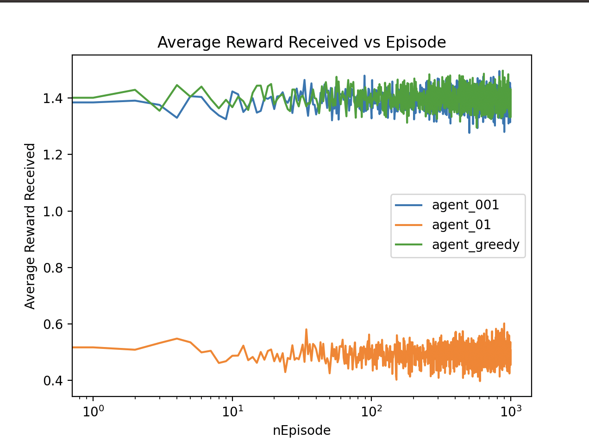

## Introduction
RL uses training information that evaluates the actions taken rather than instructs by giving correct actions, which is used in other forms of learning. We can create/collect RLHF data using RL Agents, also labelled data can be collected too.

*Question* Why do we need exploration, why not just exploit?
Exploration allows for an explicity search for good behaviour, if we just use exploitation we will get purely evaluative feedback, we won't be able to know which action is best or worst (we will not reach optimal policy).

## Evaluative feedback vs Instructive Feeback
* One depends entirely on the action taken, whereas other is independent of the action taken (non associative setting).
* We will take a case which doesn't involve learning to act in more than one situation, and study evaluative aspect; to understand how evaluative feedback differs from, and yet can be combined with, constructive feedback.

## A k-armed Bandit Problem
Learning problem where you are faced repeatedly with a choice among k different options or actions. After each choice you receive a numerical reward chosen from a **stationary probability distribution** that depends on the action you selected. 

Objective: maximize expected total reward over some time period.

### Analysis: 
* Each of the k actions has an expected or mean reward given that that action is selected, we call this value of that action.

$$q^*(q) = E[R_t|A_t=a]$$

Selecting the action with highest value would be optimal.

### Exploration vs Exploitation
We don't have the exact value of each actions, but we store an estimated value of action a at time step t $Q_t(a)$ which will be updated, to make the estimate as close as possible to $q^*(a)$

* We take greedy actions, the action with estimated value is greatest at current time step, ie, exploiting current knowledge of values of the actions.
* Instead if we take one of the non-greedy actions then we say we are exploring, it allows improving the estimate of non-greedy action's value. 
* Exploration may produce greater total reward in long run, but is lower in the short run.

"Conflict" between exploration and exploitation, since both are not possible with any single action selection.

## Action-value Methods
* $\epsilon$-greedy or near-greedy action selection rule is behave greedily (ie, exploiting the knowledge) to behave greedily most of the time, but every once in a while, say with small probability $\epsilon$, instead select randomly from among all the actions with equal probability. 
* Every action will be sampled an infinite number of times, ensuring all the estimates Q_t(a) converges to q*(a).

## Results on 10-arm bandit testbench

### Average Reward vs Episode

* Each episode consits on 2000 runs
* The environment is not influenced by the agent.
* The agent_greedy (which only exploits), agent_01 has epsilon of 0.1 and agent_001 has epsilon of 0.01.

[Exercises](./Exercises.md)