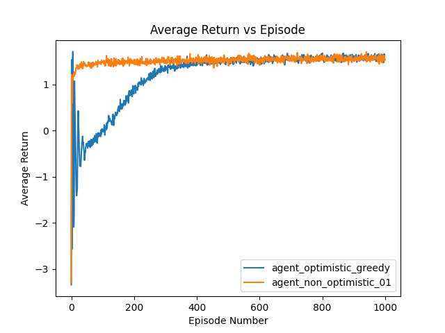
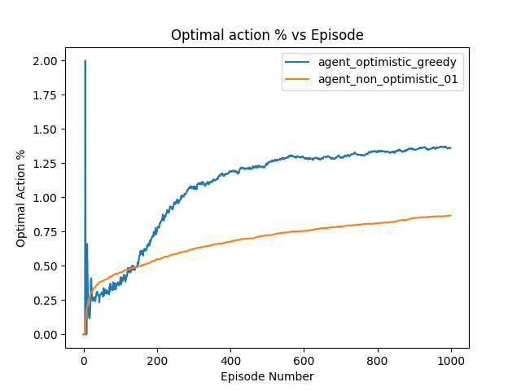

[Exercises](./Exercises.md)

### Fun Fun: 
I'm not reading the book properly, it is clearly visible while trying to do coding exercises after reading. 
If only I was not doing these questions, I wouldn't have realised my mistake.

## Introduction
RL uses training information that evaluates the actions taken rather than instructs by giving correct actions, which is used in other forms of learning. We can create/collect RLHF data using RL Agents, also labelled data can be collected too.

*Question* Why do we need exploration, why not just exploit?
Exploration allows for an explicity search for good behaviour, if we just use exploitation we will get purely evaluative feedback, we won't be able to know which action is best or worst (we will not reach optimal policy).

## Evaluative feedback vs Instructive Feeback
* One depends entirely on the action taken, whereas other is independent of the action taken (non associative setting).
* We will take a case which doesn't involve learning to act in more than one situation, and study evaluative aspect; to understand how evaluative feedback differs from, and yet can be combined with, constructive feedback.

## A k-armed Bandit Problem
Learning problem where you are faced repeatedly with a choice among k different options or actions. After each choice you receive a numerical reward chosen from a **stationary probability distribution** that depends on the action you selected. 

Objective: maximize expected total reward over some time period.

### Analysis: 
* Each of the k actions has an expected or mean reward given that that action is selected, we call this value of that action.

$$q^*(q) = E[R_t|A_t=a]$$

Selecting the action with highest value would be optimal.

### Exploration vs Exploitation
We don't have the exact value of each actions, but we store an estimated value of action a at time step t $Q_t(a)$ which will be updated, to make the estimate as close as possible to $q^*(a)$

* We take greedy actions, the action with estimated value is greatest at current time step, ie, exploiting current knowledge of values of the actions.
* Instead if we take one of the non-greedy actions then we say we are exploring, it allows improving the estimate of non-greedy action's value. 
* Exploration may produce greater total reward in long run, but is lower in the short run.

"Conflict" between exploration and exploitation, since both are not possible with any single action selection.

## Action-value Methods
* $\epsilon$-greedy or near-greedy action selection rule is behave greedily (ie, exploiting the knowledge) to behave greedily most of the time, but every once in a while, say with small probability $\epsilon$, instead select randomly from among all the actions with equal probability. 
* Every action will be sampled an infinite number of times, ensuring all the estimates Q_t(a) converges to q*(a).

## Results on 10-arm bandit testbench

### Average Reward vs Episode

* Each episode consits on 2000 runs
* The environment is not influenced by the agent.
* The agent_greedy (which only exploits), agent_01 has epsilon of 0.1 and agent_001 has epsilon of 0.01.

## Incremental Implementation

$$Q_{n+1} = 1/n \sigma_{i=1}^{n}R_i$$
$$Q_{n+1} = Q_n + 1/n[R_n-Qn]$$

$$NewEstimate <- OldEstimate + StepSize [Target - OldEstimate]$$

The expression [Target - OldEstimate] is an error in the estimate.

Here, 1/n is called step-size parameter 1/n, generally denoted by $\alpha$ or by $\alpha_t(a)$.

## Tracking a Nonstationary Problem
The averaging method is appropriate for stationary bandit problems, but not bandit problems in which reward probabilities change over time.

Can be done using a constant step-size parameter instead of using step-size parameter that depends on number of terms in the average. This creates exponential recency-weighted average.

## Convergence guarantees.

Let $\alpha_n(a)$ denote the step-size parameter used to process the reward received after the nth selection of action a.

Using stochastic approximation theory, the following conditions are required to assure convergence with probability 1.

$$\sigma_{n=1}^{\infinity}\alpha_n(a) = \infinity$$ and
$$\sigma_{n=1}^{\infinity}\alpha_n^2(a) < \infinity$$

The first condition gurantee that the steps are large enough to eventually overcome any initial conditions or random fluctuations.

The second condition gurantees that eventually the steps become small enough to assure convergence.

For non-stationary environment, ie, the most common in reinforcement learning and nature requires sequences that do not converge, and are used in applications and empirical research.

## Optimistic Initial Values
By setting the Optimistic Initial Values, encourages exploration in many cases, eg in our example if we keep Q_o(a)=+5 for all cases, all actions are explored initially even in case of greedy-method.

The sample-average methods, constant step-size method are both dependent on the initial values of q-estimates to certain extent in case of stationary distribution, for non-stationary the initial values doens't affect.

The sample-average methods, inital values play role until each action is explored once, and In constant step-size case it's affect is continued to very long extent or short-extent depending on $\alpha$.

## Upper-Confidence-Bound Action Selection

$\epsilon$ greedy action selection forces the non-greedy action, but indiscriminately, with no preference for those that are nearly greedy or particular action.

UCB allows exploration, with preference to actions, ie, based on how close their estimates are to being maximal and the uncertainity in their estimates.

$$A_t = argmax_a[Q_t(A_t)+c\sqrt(\frac{ln(t)}{N_t(a)})]$$

If $N_t(a)=0$, then a is considered to be a maximizing action.

The number c controls confidence levels, degree of exploration. The t term, makes sure that, uncertainity of increases when any other action apart from a is choose, and 1/N_t(a) decreases as we choose a. This is very good represtantation of Upper Confidence Bound, as name suggests.

UCB is difficult than epsilon greedy to extend beyond bandits:
* difficulty dealing with non-stationary problems, more sophisticated methods should be used.
* difficulty dealing with large-state spaces, particulary when using function approximation
* In more advanced cases, UCB is not even practical.

## Gradient Bandit Algorithm
* It is different from choosing actions based on estimated action values. 
* Uses numerical preference for each action for choosing actions
* These numerical preferences have **no interpretation in terms of reward**, in contrast with estimated action values (ie, which is estimated mean reward we get.)
* only relative preference of one action over other is needed for choosing action, $H_t(a) \in R$, (if we add 1000 to all numerical preference there will be no affect on action probabilities)
$$Pr\{A_t=a\} = \frac{e^{H_t(a)}}{\Sigma_{b=1}^{k}e^{H_t(b)}} = \pi_t(a)$$

* This $\pi_t(a)$ is probability of taking action a at time t.

We can learn the softmax-action preferences based on stochastic gradient ascent algorithm.

$$H_{t+1}(A_t) = H_{t}(A_t) + \alpha * (R_t - \bar{R_t}) * (1 - \pi(A_t)) \text{ and}$$
$$H_{t+1}(a) = H_t(a) - \alpha * (R_t - \bar{R_t}) * \pi(a)  \text{ for all } a!=A_t$$

* $\bar{R_t}$ is called baseline reward, can be anything which is not dependent on the A_t, the proof for above stochastic gradient ascent algorithm from the book sutton and barto is very simple, rigorous and elegant. 

* The $\bar{R_t}$ is simple average over all the rewards gained, over all actions, can be moving average reward too for non-stationary distribution, depends on alpha, constant step-size parameter.

## Associative Search (contextual bandits)
Associative tasks are tasks where we need to associate different actions with different situations, unlike the non-associative task we discussed above k-arm bandit problem, where we are trying to single best action when the task is stationary, and track the best action as it changes over-time when task is non-stationary.

### Example of associative search task or contextual bandits
Suppose we have several different k-armed bandit tasks, and each step we will be given one of the k-armed bandit task sampled from a distribution. If this task-selection-distribution is stationary, then again this is k-armed bandit problem. (visualise why).
If the task-selection-distribution is not stationary, and we are given a signal eg color to indicate the task. Then we need to learn policy (ie, mapping a situation to action that are best in that situation).

Associative search tasks (contextual bandits) are intermediate b/w the k-armed bandit problem and full-reinforcement learning problem. They are like full-reinforcement learning problem in that they involve learning a policy, but they are also like our k-armed bandit problem in that each action only affects the immediate reward. If actions are allowed to affect the next situation as well as the reward, then we have full-reinforcement learning problem