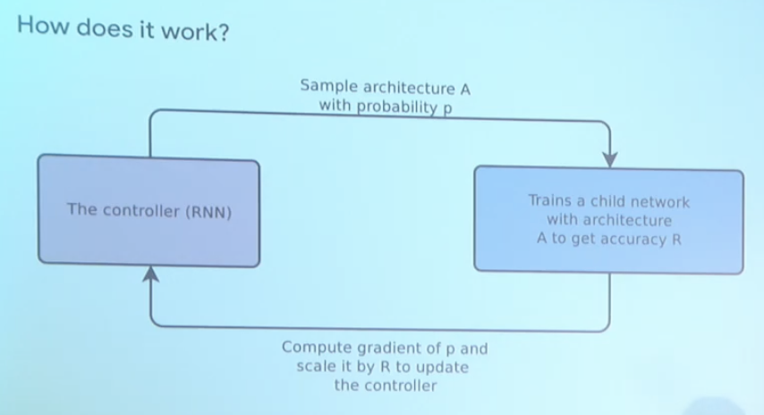

# Neural Architecutre Search

## Building Blocks
### Model Search Spaces
* The search space defines the type of neural network that will be designed and optimized
* defines the set of operations (eg convolutions, fully-connected, pooling) and how operations can be connected to form a valid network architectures.
* involves human expertise, as well as human biases.

### Search Strategy (including Model Generator | Performance Estimation)
* The search strategy defines the approach used to explore the search space
* A NAS AI Generator samples a population of network architecture candidates
* The process of candidate evaluation could be very expensive as the number of child models can be very large
* The idea is to estimate the performace of a possible NN from its design (without constructing and training it)

### Search Algorithm
* It receives the child model performace metrics as rewards (eg: high accuracy, low latency)
* It optimizes to generate high-performance candidate (eg: via policyt gradient)

### Model Evaluation
* The mathematical models constructed by NAS will be evaluated against-validation data.
* In regard, performance metrics (such as accuracy, AP, or Flops) will be measured

We use policy gradient to build the gradients and update the parameters.

### WorkFlow
* A controller is used to generate their 'hyperparameters' as a sequence of tokens which includes layers, and individual building blocks.
* Training the network specified by the controller - 'child network' will result in a metric which is used to update the controller.

### Reward
* A metric (accuracy, latency, memory, combination of those) as the reward signal.

### Policy Optimization
* An optimization problem under uncertainty.
* NAS often optimizes a non-differentiable metric. eg accuracy of the child network.

### What to compute
* Estimation of the performance of child network
* The performance metric of child network
* The policy gradient to update the controller.

## Insights
I think this approach of considering non-differentiable parameters can be used in case of Learning to Optimize framework allowing us to learn optimizer which is able to produce quantised weights of the model.

