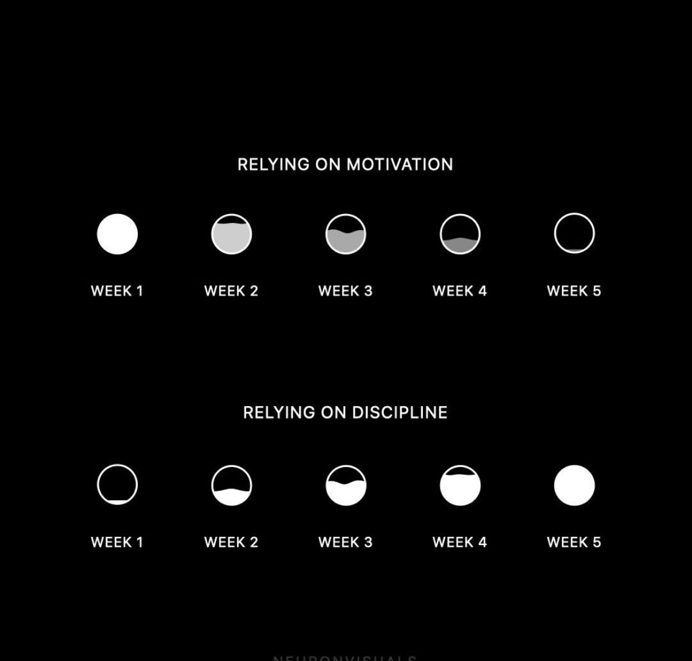

# Deep-RL Notes

### Quote

Motivation may come and go, but discipline is what gets you through the tough times.

While motivation can be a powerful force in driving you forward, it can also be fleeting and unreliable. Discipline, on the other hand, is a habit that you can cultivate and rely on even when motivation wanes.

By relying on discipline, you train yourself to commit to your goals, push through obstacles, and take consistent action even when you don't feel like it.

This approach helps you build resilience, cultivate self-discipline, and stay committed to your goals over the long term. It also frees you from the ups and downs of relying on motivation and allows you to focus on the process of achieving your goals.

Cultivate discipline as a long-term strategy for success.